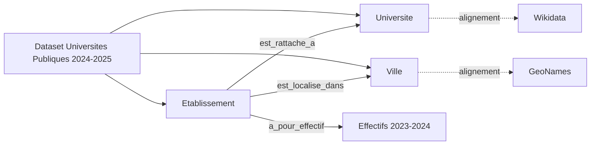

# Rapport hors séance - TP1

## Page de garde

- **Module** : Linked Open Data
- **TP** : TP1 - Introduction aux données ouvertes liées
- **Groupe** : Groupe 01
- **Étudiants** : Hamza Salhi, Abdullah Assoumanou
- **Date** : 18 avril 2026

## Consigne

Ce rapport est à remettre **avant la prochaine séance**. Il constitue une **étude distincte** du travail réalisé pendant le TP1 en classe et prépare directement le TP2.

## 1. Introduction

Présentez en quelques lignes le contexte du TP, le jeu de données choisi, les entités retenues pour le travail hors séance et le problème d'ingénierie des données que vous étudiez.

Ce travail porte sur le cas réel imposé : la ressource officielle **Universités Publiques 2024-2025** publiée sur le portail data.gov.ma. Après nettoyage structurel du fichier XLSX, le dataset contient **165 établissements**, rattachés à **12 universités**, répartis dans **38 villes**.

Conformément à la description de la source, ce périmètre comprend **162 établissements de formation** et **3 instituts de recherche scientifique**.

Nous avons retenu trois types d'entités prioritaires : **établissement**, **université** et **ville**. Le problème d'ingénierie des données étudié est la préparation de ces entités à une future publication en données ouvertes liées, en particulier :

- la normalisation des valeurs textuelles
- l'identification de clés d'appariement fiables
- la réduction des risques de faux appariement avant une modélisation RDF

## 2. Types d'entités étudiés

Présentez :

- les `2 à 3` types d'entités retenus pour le travail hors séance
- les raisons de ce choix
- les champs ou indices disponibles pour les apparier à des référentiels externes

### Entité 1 : Etablissement

- Raison du choix : entité centrale du dataset, granularité principale de la future base liée.
- Indices d'appariement disponibles : `Etablissement`, `Etablissement (Abr)`, `Ville`, `Adresse`.

### Entité 2 : Université

- Raison du choix : structure d'organisation des établissements (relation établissement -> université).
- Indices d'appariement disponibles : `Université`, colonne arabe de l'université, regroupements par ville.

### Entité 3 : Ville

- Raison du choix : ancrage géographique indispensable pour relier le jeu de données à des référentiels externes territoriaux.
- Indices d'appariement disponibles : `Ville`, `Adresse`, pays implicite (Maroc).

## 3. Benchmark des référentiels externes

Comparez au moins deux référentiels externes étudiés pour vos entités cibles :

- couverture
- précision apparente
- qualité des identifiants
- richesse sémantique
- facilité d'utilisation pour un futur alignement

| Référentiel | Couverture | Précision apparente | Qualité des identifiants | Richesse sémantique | Facilité d'utilisation |
| --- | --- | --- | --- | --- | --- |
| Wikidata | Bonne pour universités, variable pour établissements spécialisés | Élevée sur institutions majeures | QID stables et persistants | Très bonne (alias, liens externes, propriétés) | Moyenne (nécessite désambiguïsation) |
| GeoNames | Très bonne pour villes | Élevée pour toponymes marocains | geonameId stables | Bonne sur hiérarchie géographique | Élevée pour les villes |
| DBpedia | Moyenne à faible selon établissements | Moyenne | URI stables mais couverture incomplète | Bonne en linked data mais moins homogène | Moyenne à faible |

Conclusion benchmark :

- **Wikidata** est le référentiel principal recommandé pour universités/établissements.
- **GeoNames** est le référentiel principal recommandé pour les villes.
- **DBpedia** est utile comme source de vérification complémentaire, pas comme référentiel principal.

## 4. Cas d'appariement manuel

Présentez vos cas d'appariement les plus significatifs :

- entité locale
- référentiel cible
- indices utilisés
- niveau de confiance
- ambiguïté éventuelle
- décision finale

| Entité locale | Référentiel cible | Indices utilisés | Niveau de confiance | Ambiguïté | Décision finale |
| --- | --- | --- | --- | --- | --- |
| Université Mohammed V - Rabat - | Wikidata | nom + ville + notoriété institutionnelle | Élevé | faible | appariement retenu |
| Université Hassan II - Casablanca - | Wikidata | nom + ville + cohérence contextuelle | Élevé | faible | appariement retenu |
| ENSIAS Rabat | Wikidata | abréviation ENSIAS + ville + rattachement universitaire | Moyen à élevé | moyenne (composante d'université) | appariement retenu avec vérification manuelle |
| Rabat | GeoNames | toponyme exact + pays MA | Élevé | faible | appariement retenu |
| Kénitra | GeoNames | toponyme + variante d'accent + pays MA | Élevé | faible à moyenne | appariement retenu |
| Faculté Polydisciplinaire Kssar El Kébir | DBpedia | nom + ville, test de couverture | Faible à moyen | élevée (candidat non stable) | appariement non retenu |

Bilan des cas : les appariements géographiques sont plus simples et plus stables que les appariements d'établissements spécialisés.

## 5. Plan de normalisation et d'identification

Expliquez :

- quelles valeurs doivent être normalisées
- quelles règles doivent être appliquées avant un futur travail RDF
- quelles entités devraient recevoir un identifiant stable
- comment ces identifiants pourraient être construits conceptuellement

Les champs prioritaires à normaliser sont : `Université`, `Etablissement`, `Etablissement (Abr)`, `Ville`, `Effectifs des Etudiants 2023-2024`, `Adresse`, `Téléphone`, `Fax`.

Règles appliquées avant futur RDF :

- normalisation des espaces et ponctuation
- normalisation Unicode (notamment pour les champs arabes)
- harmonisation des accents dans les noms de villes
- conversion des effectifs en numérique et gestion explicite des valeurs manquantes
- standardisation des formats de téléphone/fax

Entités devant recevoir un identifiant stable :

- Etablissement : `ma-etab-{abbr}-{ville}` (+ suffixe anti-collision si besoin)
- Université : `ma-univ-{nom-normalise}`
- Ville : `geonames:{id}` si appariement confirmé, sinon identifiant local provisoire

Cette stratégie permet de construire des URI cohérentes, lisibles et réutilisables pour TP2.

## 6. Analyse des risques

Discutez :

- des risques de faux appariement
- des cas de désambiguïsation
- des limites des référentiels choisis
- des informations manquantes dans votre dataset

Risques principaux identifiés :

- **Faux appariement par similarité de nom** : établissements différents avec noms proches.
- **Ambiguïté composante vs université** : une école peut être indexée comme entité indépendante ou comme composante d'une université.
- **Variantes orthographiques et accents** : Fès/Fes, Kénitra/Kenitra.
- **Couverture incomplète de DBpedia** : certains établissements ne disposent pas d'entité fiable.

Informations manquantes qui limitent l'alignement :

- identifiant administratif officiel unique par établissement
- champ explicite de type d'établissement (faculté, école, institut)
- codification territoriale normalisée (code ville/région)

Mesure de mitigation retenue : appariement multi-indices (nom + abréviation + ville + vérification manuelle).

## 7. Difficultés rencontrées

Expliquez les problèmes rencontrés pendant le travail hors séance :

- absence ou faiblesse des identifiants
- qualité insuffisante de certaines valeurs
- limites de couverture des référentiels
- difficultés de désambiguïsation

Difficultés réellement rencontrées :

- Le fichier XLSX contient une ligne titre et une ligne d'en-têtes multi-niveaux, ce qui nécessite un prétraitement avant analyse.
- Les identifiants techniques sont absents : aucune clé primaire métier explicite dans la source.
- Plusieurs formats de téléphone/fax rendent les contrôles d'intégrité moins fiables.
- Certains établissements sont difficiles à apparier dans DBpedia, ce qui oblige à prioriser Wikidata.
- Les variations d'écriture (accents, translittération arabe/français) imposent une normalisation stricte avant alignement.

## 8. Conclusion

Concluez sur la valeur de cette étude préparatoire et sur la manière dont elle facilite la séance suivante.

Cette étude montre que le jeu de données officiel est exploitable pour une préparation LOD sérieuse, à condition de traiter d'abord la qualité des valeurs et la stratégie d'identifiants. Le benchmark confirme une combinaison pragmatique : **Wikidata** pour les institutions, **GeoNames** pour la géographie, **DBpedia** comme source secondaire.

Pour TP2, le travail effectué apporte :

- une base de normalisation claire
- des cas d'appariement déjà documentés
- une stratégie d'identifiants réutilisable pour la construction d'URI

La prochaine étape logique est de transformer ce plan en modèle conceptuel, puis en triples RDF avec alignements externes validés.

## Annexes éventuelles

Vous pouvez ajouter si nécessaire :

- une capture du jeu de données source
- un schéma conceptuel
- un tableau complémentaire de liens externes

Annexe suggérée pour la version finale :

- capture de la feuille "Universités Publiques" (5 premières lignes de données)
- mini schéma conceptuel : Etablissement -> Université, Etablissement -> Ville, Ville -> GeoNames
- tableau de suivi des appariements à revalider (statut: retenu/non retenu)

Schéma conceptuel Mermaid :

