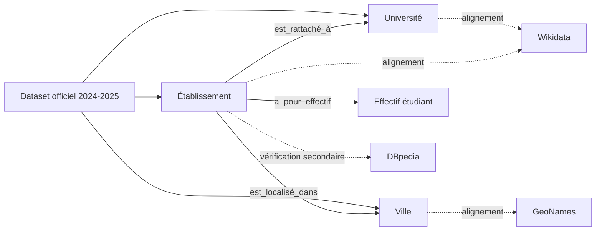

# Carte des entités et des liens potentiels

## 1. Inventaire des entités

| Entité ou type d'entité | Exemple local | Pourquoi s'agit-il d'une entité ? | Attributs associés | Identifiant local potentiel |
| --- | --- | --- | --- | --- |
| Etablissement | Ecole Mohammadia d'Ingénieurs Rabat | Objet principal décrit par chaque ligne du dataset | Etablissement, Etablissement (Abr), Adresse, Téléphone, Fax, Effectifs | ma-etab-emi-rabat |
| Université | Université Mohammed V - Rabat - | Structure de rattachement de plusieurs établissements | Université, الجامعة | ma-univ-universite-mohammed-v-rabat |
| Ville | Rabat | Entité géographique transverse pour la localisation | Ville, Adresse | geonames:2538475 (après validation) |
| Effectif (mesure) | 9895 | Attribut quantitatif réutilisable dans des analyses liées | Effectifs des Etudiants 2023-2024 | mesure rattachée à l'établissement |

## 2. Relations conceptuelles observées

| Source | Relation conceptuelle | Cible | Cardinalité | Commentaire |
| --- | --- | --- | --- | --- |
| Etablissement | est_rattaché_à | Université | N:1 | Plusieurs établissements appartiennent à une université |
| Etablissement | est_localisé_dans | Ville | N:1 | Chaque établissement est situé dans une ville donnée |
| Université | couvre_des_établissements | Etablissement | 1:N | Relation inverse de rattachement |
| Ville | accueille | Etablissement | 1:N | Ex: Rabat et Casablanca accueillent plusieurs entités |
| Etablissement | a_pour_effectif | Effectif (mesure) | 1:1 (année donnée) | Mesure temporelle à qualifier par année |

## 3. Liens externes proposés

| Entité locale | Ressource externe candidate | Type de lien envisagé | Critères d'appariement | Justification | Bénéfice attendu | Niveau de confiance | Risque |
| --- | --- | --- | --- | --- | --- | --- | --- |
| Université Mohammed V - Rabat - | [Recherche Wikidata](https://www.wikidata.org/w/index.php?search=Universit%C3%A9+Mohammed+V+Rabat&title=Special%3ASearch&ns0=1) | exactMatch (après validation) | Nom + ville + cohérence institutionnelle | Université majeure, forte probabilité de présence Wikidata | URI institutionnelle stable | Élevé | Homonymie faible |
| Université Hassan II - Casablanca - | [Recherche Wikidata](https://www.wikidata.org/w/index.php?search=Universit%C3%A9+Hassan+II+Casablanca&title=Special%3ASearch&ns0=1) | exactMatch (après validation) | Nom + ville + contexte national | Cas robuste et représentatif du dataset | Alignement fiable université | Élevé | Variantes historiques de nom |
| ENSIAS Rabat | [Recherche Wikidata](https://www.wikidata.org/w/index.php?search=ENSIAS+Rabat&title=Special%3ASearch&ns0=1) | closeMatch ou exactMatch selon vérification | Abréviation + ville + rattachement UM5 | Etablissement spécialisé utile au benchmark | Lien vers entité école/faculté | Moyen à élevé | Confusion composante vs entité autonome |
| Rabat | [Recherche GeoNames](https://www.geonames.org/search.html?q=Rabat&country=MA) | exactMatch | Toponyme + pays MA | Ancrage géographique stable | geonameId pour URI de ville | Élevé | Très faible |
| Kénitra | [Recherche GeoNames](https://www.geonames.org/search.html?q=Kenitra&country=MA) | exactMatch | Toponyme + variante accent + pays MA | Cas utile de normalisation accentuée | Désambiguïsation géographique | Élevé | Faible |
| Faculté Polydisciplinaire Kssar El Kébir | [Recherche DBpedia](https://lookup.dbpedia.org/index.html?query=Kssar+El+K%C3%A9bir) | closeMatch candidat | Nom + ville | Test de couverture DBpedia sur entités moins centrales | Vérification secondaire linked data | Faible à moyen | Absence d'entrée ou faux positif |

## 4. Schéma conceptuel

Vous pouvez insérer ici :

- une capture d'écran d'un schéma
- ou un diagramme Mermaid

Exemple Mermaid purement conceptuel :

## 5. Analyse critique

- Quels liens vous paraissent les plus fiables ?
- Quels liens restent incertains ?
- Quelles informations supplémentaires faudrait-il pour automatiser les correspondances ?
- Quelles entités devraient recevoir un identifiant stable en priorité ?
- Quels risques de faux positifs ou de collisions d'identifiants avez-vous identifiés ?

Réponses :

- Les liens les plus fiables sont les villes vers GeoNames et les universités majeures vers Wikidata.
- Les liens les plus incertains concernent les établissements spécialisés ou récents, surtout via DBpedia.
- Pour automatiser davantage, il faut un identifiant administratif officiel par établissement et un code territorial normalisé.
- Les entités à identifier en priorité sont : établissement puis université, puis ville.
- Le principal risque de faux positif est la similarité de noms entre composantes universitaires et entités autonomes.
- Le principal risque de collision est l'usage d'une abréviation seule sans contexte de ville/université.
